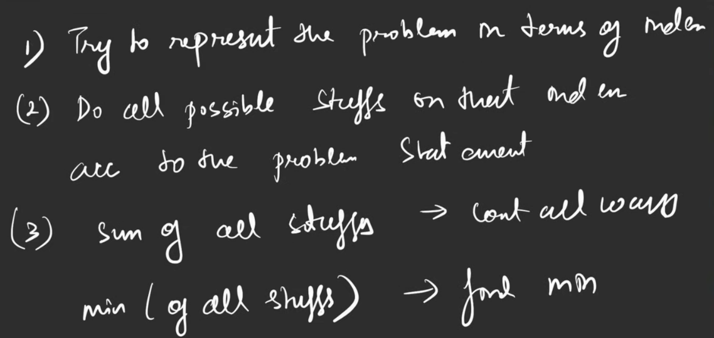

# Data Structures and Algorithms

## Two Pointers
* **Same Direction**
* **Opposite Directions**

## Sliding Window
* **Start and End Pointer**

> Substring, max substring problems often leverage Two Pointers or Sliding Window techniques.

## Binary Search
* Time Complexity: $O(\log n)$
* Applicable only to sorted lists.

## Trees and Graphs

* **Breadth-First Search (BFS)**
    * Uses a queue.
    * Ideal for finding shortest paths.
* **Depth-First Search (DFS)**
    * Uses a stack.
    * Suitable for exploring all paths.
    * **Backtracking:** An extension of DFS.

  # Binary Trees
1. **Complete binary tree:** all nodes have 2 children, at last level, can have 1, but must be filled left to right
2. **Full/Strict BT:** either 0 children, or 2 children, all nodes.
3. **Perfect binary tree:** all have 2, all leaf nodes on same level.
4. **Height balanced tree:** avg height O(logn)
5. **Skewed binary tree:** avg height O(n), every node 1 child
6. **Ordered binary tree:** every node follos some property e.g. BST

- Number of nodes in perfect BT: 2^(h+1) - 1
- Number of lead nodes in perfect BT: 2^h
- If N leaves, min. log(n)+1 nodes

# AVL Tree
- self balancing binary tree
- max diff between heights of left and right sub trees is 1
- **Insertion:** check bottom up for first unbalanced node. 4 cases
  1. right heavy (height(node.right) - height(node.left) > 1)
     1a. right-right -> leftRotate(node)
     1b. right-left -> rightRotate(node.right) [makes it same as 1a] -> leftRotate(node)
  2. left heavy (height(node.left) - height(node.right) > 1)
     2a. left-left -> rightRotate(node)
     2b. left-right -> leftRotate(node.left) [makes it same as 2a] -> rightRotate(node)

# Segment Tree
- perfrom operation on a range -> sum, product, max, min, avg in O(logn)
- O(logn) updates.
- binary tree which has info about range/interval and operation(sum, prod etc)
- 
- it is full binary tree -> 2N-1 nodes.
- => time to build -> O(n) [done in post order traversal manner], update O(logn) [done in post order], query O(logn)

## **Priority Queue (Heaps)**
* Helpful in finding elements that satisfy a specific condition (e.g., finding a largest number).
* Stored as an array but conceptually represented as a tree.
* Must be a complete binary tree.
* > number of leaf nodes in complete binary tree = n/2
* Every node's value is greater than or equal to all its children (for a max-heap; reverse for min-heap).

### Array Representation Formulas:
1.  Parent of index $i = \lfloor i/2 \rfloor$
2.  Left child of index $i = 2i$
3.  Right child of index $i = 2i + 1$
> No pointers are required for heap implementation using an array.
* 
    * **Min-Heap:** Parent node value is less than or equal to its children's values (useful for finding *k* largest values).
    * **Max-Heap:** Parent node value is greater than or equal to its children's values (useful for finding *k* smallest values).
    * Insertion
      * Time Complexity: $O(\log n)$
      * add at end, then check with parent, if violates condition (min/max), swap with parent - do this recursively, now with the parent.
      * => going up the heap - upheap()
    * Deletion
      * since heaps are being used, we assume that deletion needs to be done at top.
      * Time complexity: $O(\log n)$
      * store and remove last element, swap stored value with root, check with children, find the child which best satisfis the condition (max/min) and swap with it - do this recursively, now with chosen child.
      * going down the heap from root => downheap()
    * Access Time Complexity: $O(1)$
    * HeapSort - to get sorted array from heap.
      * get root element, delete, get root, delete...
      * for n elements, each removal log n => $O(NlogN)$
    * Unsorted array to heap:
      * we need every node to satisy min/max condition.
      * since leaves dont have children, can skip leaves
      * number of leaf nodes = n/2
      * so from n/2 to 0 index, do downheap

## Dynamic Programming (DP)

* **Bottom-Up**
* **Top-Down:** Backtracking with memoization.

---

> 
> 

### Problem Solving Approach:
1.  Read the question twice.
2.  Formulate a rough, brute-force idea.
3.  Hand draw/write out the solution.

---

# Sortings

1.  **Selection Sort:** Find the minimum element and swap it with the element at the current position.
2.  **Bubble Sort:** Repeatedly swap adjacent elements to push the maximum element to the end.
3.  **Insertion Sort:** Take an element and insert it into its correct position within the sorted portion of the array.
                        - start from 2nd element, compare with all previous elements, while it is smaller, swap.
5.  **Merge Sort:**
    * **Divide:** Split the array into two halves (left and right) using a midpoint.
    * **Sort:** Recursively sort the left and right halves.
    * **Merge:** Combine the sorted left and right halves.
6.  **Quick Sort:**
    * Pick a pivot element. All elements to the left of the pivot should be smaller, and all to the right should be larger.
    * Often, the first element is chosen as the pivot.
    * **Partitioning Process:**
        * While (left pointer < right pointer):
            * Find the first element on the left that is greater than the pivot.
            * Find the first element on the right that is less than the pivot.
            * Swap these two elements.
    * Recursively apply to sub-arrays.

---

