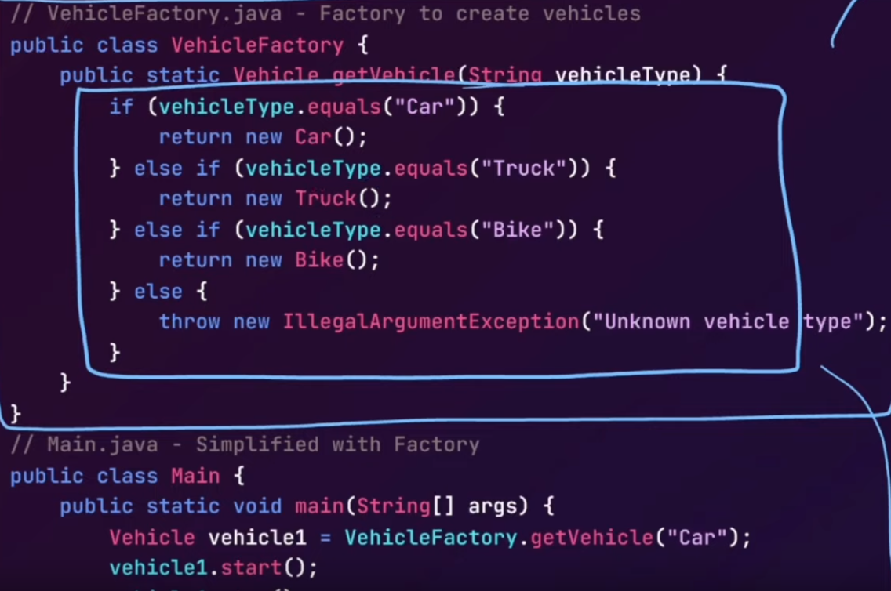

# LLD

## Design Principles
### SOLID Principle
1. **Single Responsibility Principle**: each class should have one job/purpose
    * improved extensibility
    * readibility
    * debugging
    * maintainability
    * change in one doesnt affect others
2. **Open Closed Principle**: entities should be open for extension but closed for modification
    * prevents breaking existing code
    * encourages resuable components
3. **Liskov Substitution Principle**: any child class should be usable in place of its parent without unexpected behavior
    * reliability in polymorphism
    * no unexpected behavior
4. **Interface Segregation Principle**: dont force any client to implement any interface not relevant to it, kinda like SRP for interfaces. Avoid fat interfaces, smaller more focused ones better, since classes would only need to implement methods relevant to their functionality.
5. **Dependency Inversion Principle**: depend on interfaces rather than concrete classes.
    * high level modules should'nt depend on low level modules, both should depend on abstractions.
    * abstractions should not depend on details, details should depend on abstractions.
    * E.g.: one logger. needs EmailNotificationService. uses that class in it.
       * now if i want to have SMSNotification instead of email, i gotta change code.
       * instead, make a NotificationService interface, make SMS and Email services implement them, and in the logger class, just have NotificationService object.
       * now calling function can send whatever type of notification it wants.

### DRY Principle
* **Dont Repeat Yourself**: create reuseable components, functions or modules that can be utilised in different parts of the codebase.
* Features:
    * readibility
    * maintainability
    * reusability
    * consistency
    * testability
    * less development time
    * avoid copy paste
* How to?
    * use functions
    * use OOPs principles
    * use constants, configuration files

### KISS
* **Keep It Simple, Stupid**: simplicity in design and implementation.
* thin line between scalable and maintainable and over complicated code.
* How to implement?
  * break down problems
  * avoid over engineering
  * use clear naming conventions
  * use existing design patterns
  * write modular code

### YAGNI
* **You Aren't Gonna Need It**: should only implement features necessary for current requirements.

## Creational Design Patterns
- manage how objects are created, provide smart, controlled way to handle object creation process.
- centralize and streamline creation, make system flexible and easier to maintain.

1. **Singleton Pattern**
   * ensures only one instance of class throughout system.
   * reduce resource wastage, ensure consistent behavior
   * useful for managing shared resources like config manager, logging service, thread pool. here, we need a single point of control.
   * no competing for access
   * have a private constructor, and a static method to return the instance.
   * 
   * we need to ensure if instance is not created, 2 instances are not made by 2 different threads, so need synchronisation.
   * but if we make whole mehod synchronised, it is expensive, so we check if its null first
   * so we make only the creation part sync.
   * lazy initialization - object only created when needed, since it may be heavy or expensive to create.

2. **Factory Method Pattern**
   * allow different types of object creations 
   * handle object creation in a centralised manner.
   * when you have a class that needs to create objects, but you want its subclasses to be responsible for specifying which objects to create.
   * also implements encapsulation
   * example - bean injection in spring.
   * 

3. **Abstract Factory Pattern**
   * creat related objects without specifying their concrete classes directly.
   * instead of modifying one method each time new brand added, just separate factories for each new brand.
   * basically if many many different object types, better to use abstract factory. 
   * 

4. **Builder Pattern**
   * construct complex objects step by step
   * large objects - object creation has lots of attributes, and not all objects will have all, still need to pass if using constructor.
   * create step by step, only attributes you need to set, add defaults, and easily extend
   * 
   * Use Cases: complex meals(toppings, drinks), documents, user profile

5. **Prototype Pattern**
   * create new object by cloning an existing prototype and modifying whats needed.
   * useful when working with similar objects.
   * e.g. - video game characters - level increases, new class now? new name then what?
   * clone the prototype and modify only the necessary attriubutes


## Behavioral Patterns
- communication between objects

1. Obeserver Pattern
   * multiple objects need to react when one object changes. can notify each object manually, but bad.
   * one object(the subject) can notify other objecs(observers) whenever there is change in its state
   * E.g.: youtube channel, notify for video upload. not all subs have the same preference set.
     * some are youtube notif, some email, etc.
     * different impelmentations for each. now objects for each subscriber based on what they have subbed for.
        ```java
        public class EmailSubscriber implements Subscriber {
        private String email;
        public EmailSubscriber(String email) {
            this.email = email;
        }
        @Override
        public void update(String video) {
            System.out.println(
                "Sending email to " + email + ": New video uploaded: " + video);
        }
        }
        public class PushNotificationSubscriber implements Subscriber {
        private String userDevice;
        public PushNotificationSubscriber(String userDevice) {
            this.userDevice = userDevice;
        }
        @Override
        public void update(String video) {
            System.out.println("Sending push notification to " + userDevice
                + ": New video uploaded: " + video);
        }
        }
        public class YouTubeChannelImpl implements YouTubeChannel {
        private List<Subscriber> subscribers =
            new ArrayList<>(); // List of subscribers
        private String video; // The video that will be uploaded
        @Override
        public void addSubscriber(Subscriber subscriber) {
            subscribers.add(subscriber); // Add a subscriber to the channel
        }
        @Override
        public void removeSubscriber(Subscriber subscriber) {
            subscribers.remove(subscriber); // Remove a subscriber from the channel
        }
        @Override
        public void notifySubscribers() {
            // Notify all subscribers about the new video
            for (Subscriber subscriber : subscribers) {
            subscriber.update(video); // Call update() for each subscriber
            }
        }
        public void uploadNewVideo(String video) {
            this.video = video; // Set the video that is being uploaded
            notifySubscribers(); // Notify all subscribers about the new video
        }
        }
        public class Main {
            public static void main(String[] args) {
            // Create a YouTube channel
            YouTubeChannelImpl channel = new YouTubeChannelImpl();
            // Create subscribers
            YouTubeSubscriber alice = new YouTubeSubscriber("Alice");
            YouTubeSubscriber bob = new YouTubeSubscriber("Bob");
            // Subscribe to the channel
            channel.addSubscriber(alice);
            channel.addSubscriber(bob);
            // Upload a new video and notify subscribers
            channel.uploadNewVideo("Java Design Patterns Tutorial");
            channel.removeSubscriber(bob);
            channel.uploadNewVideo("Observer Pattern in Action");
        }
        }
        ```

2. Strategy Pattern
   * if i want to implement multiple algorithms, for example, sorting by different criteria.
   * use different strategy decided on runtime.
   * each algo has its own class, can be called based on what is needed, add new by just making a new calls.
   * use in sorting methods, payment processor, shipping costs.
   * E.g.: payment processor -> multiple methods, each with diff implementation. dont wanna do lots of if-else, or lots of different interfaces/abstractions (still if-else when calling them). 
     * instead, different classes for each strategy, then one class that has strategy member, and a process method, and a set method, to change strategies.
        ```java
            // Concrete strategy for crypto payment
        public class CryptoPayment implements PaymentStrategy {
        public void processPayment() {
            System.out.println("Processing crypto payment...");
        }
        }

        // Concrete strategy for Stripe payment
        public class StripePayment implements PaymentStrategy {
        public void processPayment() {
            System.out.println("Processing Stripe payment...");
        }
        }

        public class PaymentProcessor {
        private PaymentStrategy paymentStrategy; // Reference to a payment strategy
        // Constructor to set the payment strategy
        public PaymentProcessor(PaymentStrategy paymentStrategy) {
            this.paymentStrategy = paymentStrategy;
        }

        // Process payment using the current strategy
        public void processPayment() {
            paymentStrategy
                .processPayment(); // Delegate the payment processing to the strategy
        }

        // Dynamically change payment strategy at runtime
        public void setPaymentStrategy(PaymentStrategy paymentStrategy) {
            this.paymentStrategy = paymentStrategy;
        }
        }

        public class Main {
        public static void main(String[] args) {
            // Create strategy instances for each payment type
            PaymentStrategy crypto = new CryptoPayment();
            PaymentStrategy stripe = new StripePayment();
            // Use the Strategy Pattern to process payments
            PaymentProcessor processor =
                new PaymentProcessor(creditCard); // Initially using CreditCardPayment
            processor.processPayment(); // Processing credit card payment...

            // Switch to Crypto
            processor.setPaymentStrategy(crypto);
            processor.processPayment(); // Processing crypto payment...
            // Switch to Stripe
            processor.setPaymentStrategy(stripe);
            processor.processPayment(); // Processing Stripe payment...
        }
        }
        ```

3. **Iterator**: traverse a collection of items without exposing underlying implementation details.
   * example - playlist iterator -> can be favorites, shuffle, normal playlist
4. **Command**
    * decouples object that trigeers the action, from the one that performs it.
   * 
5. **Mediator**
6. **State Design**
7. **Template Design**
8. **Chain of Responsibility**
9.  **Visitor**
10. **Memento**

## Structural Patterns

1. **Decorator**
   * example scenario - a text editor. at first, just basic, then adding features like spell check, auto save and turn them on if user decides to.
   * cant keep making if else statements and sub classes.
   * 

2. **Adapter**
   * acts as a bridge between two incompatible interfaces, allowing them to work together.
   * 

3. **Composite**
4. **Facade**
5. **Bridge**
6. **Proxy**
7. **Flyweight**