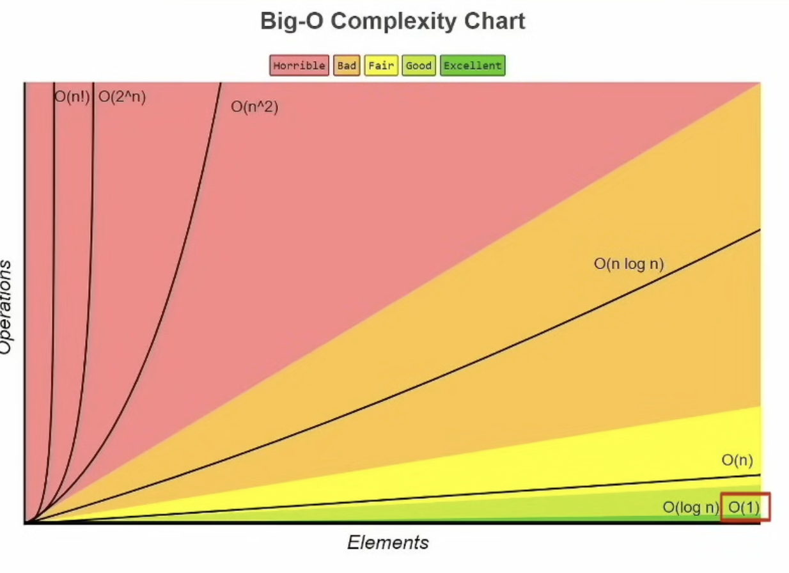
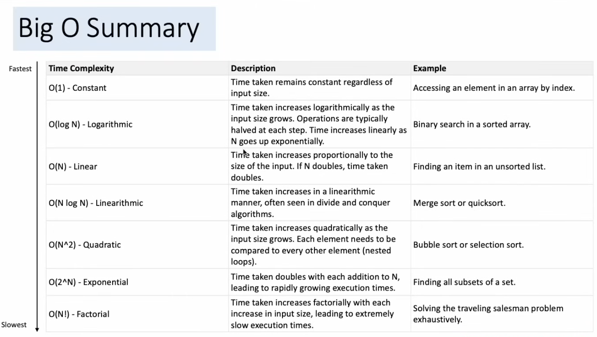

# dsa

# 2 pointers
## same direction
## opposite directions

# sliding window
## start and end pointer

### substring, max substring something -> think 2 pointer, sliding windows

# binary search
## o(logn), only on sorted lists though

# trees and graphs

## bfs - queue, for shortest paths
## dfs - stack, for exploring all paths
### backtracking - dfs extensions

## priority queue - heaps o(logn) instertion, o(1) access
### min heap - parent less than children (find k largest values)
### max heap - parent more than children (find k smallest values)

## DP
### bottom up
### top down - backtracking with memoization

## 1. read question twice
## 2. rough, brute force idea
## 3. hand draw/wrtie