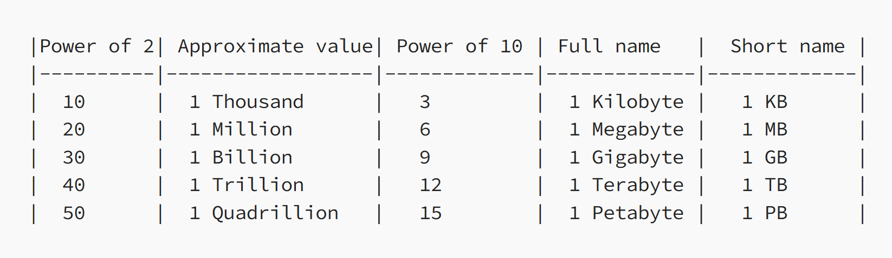
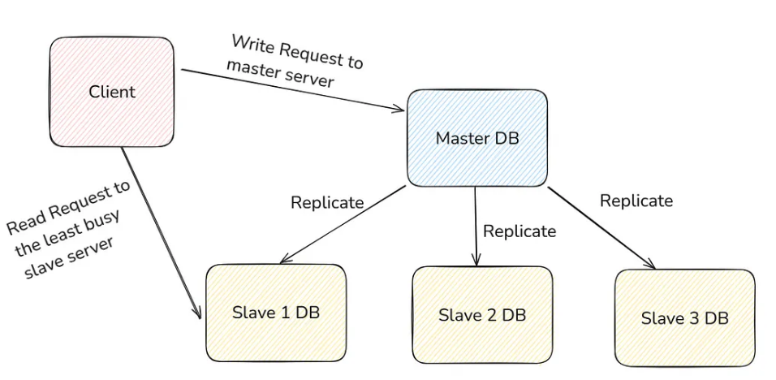
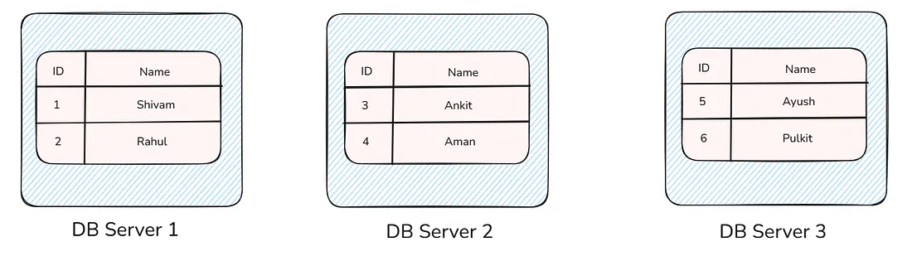
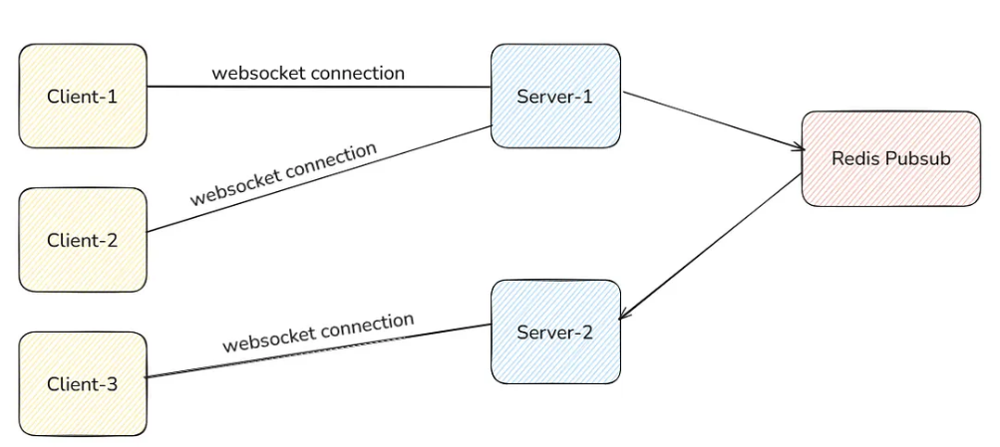
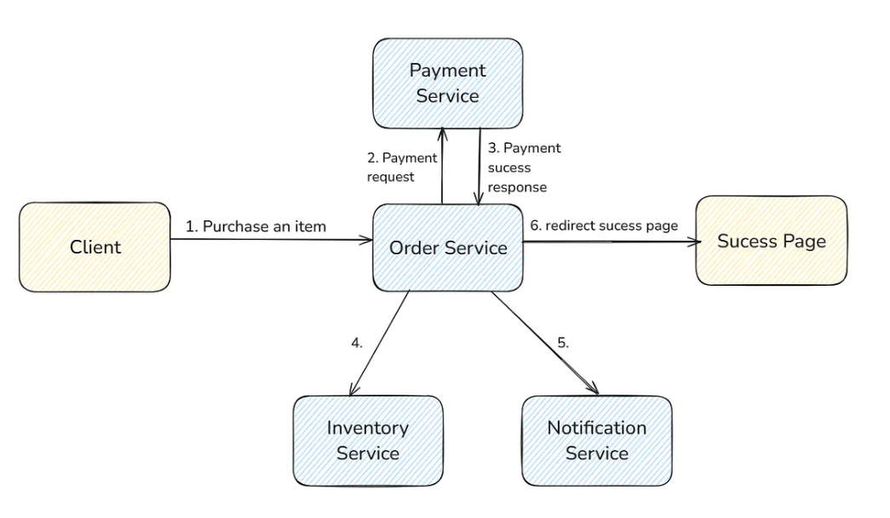
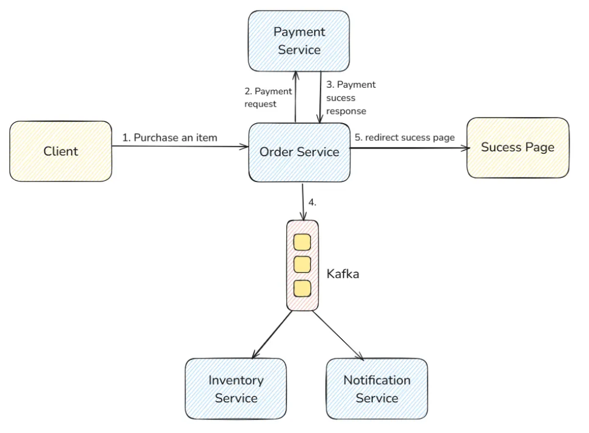
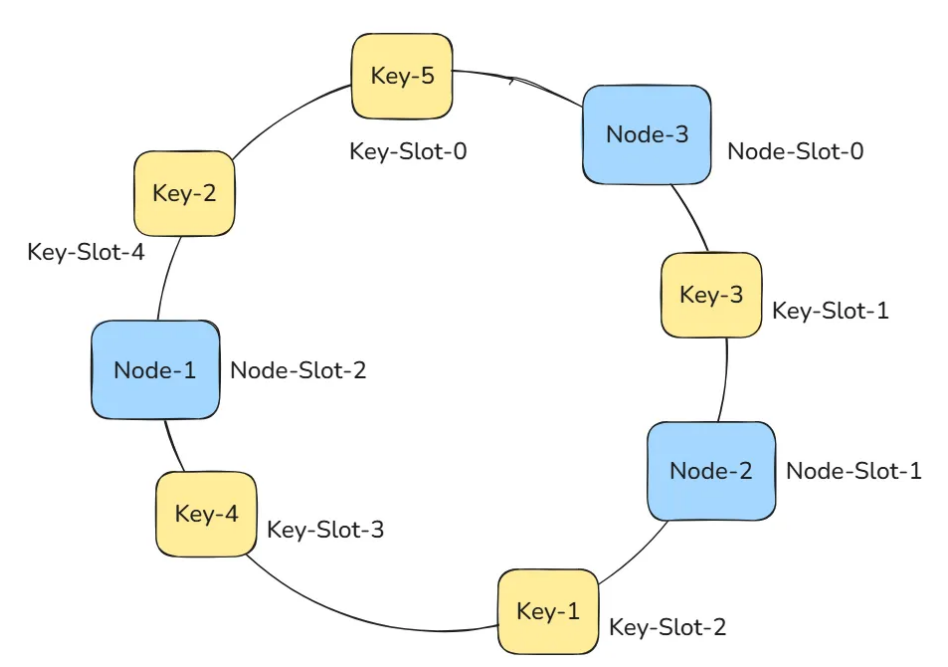
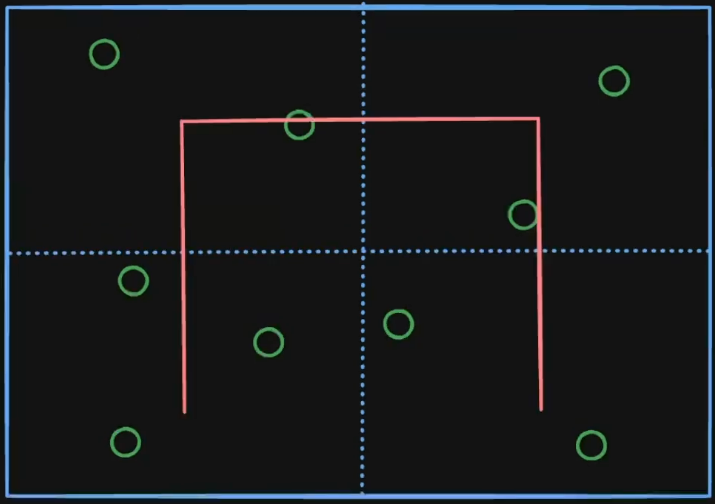
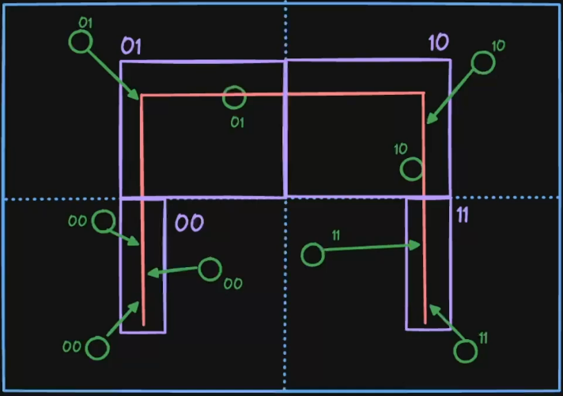
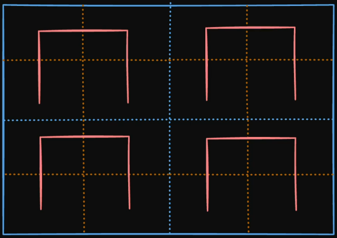

# System Design

## Scaling:
* vertical scaling - up and down
* horizontal scaling - out and in
* first prefer vertical scaling

## CAP Theorem:
states that in a distributed system, you can only guarantee two out of these three properties simultaneously. It’s impossible to achieve all three, and network partition is bound to happen, so need to make tradeoff between CP and AP
* **Consistency:** A, B and C all have the same data. If there is an update in node B, then data replication happens, and B will propagate that update to A and C.
* **Availability:** Let node B experience a hardware failure and go offline. Nodes A and C are still operational. Despite the failure of node B, the system as a whole remains available because nodes A and C can still respond to client requests.
* **Partition Tolerance:** Network partition happens that separates B from A and C. Node B can still function and serve requests, but it can’t communicate with A and C.
* for secure apps like banking, chose CP
* for social media etc, chose AP

**Types of DB Architecture:**

## Master-Slave DB Architecture:
* The node (server) which processes the write request is called the Master Node.
* Nodes (servers) that take the read requests are called Slave Nodes.
* When you make a Write Request, it is processed and written in the master node, and then it asynchronously (or synchronously depending upon configuration) gets replicated to all the slave nodes.
* good for read heavy traffic.

## Multi-Master Setup:
* more than one master
* Ex: A very common thing is to put two master nodes, one for North India and another for South India. All the write requests coming from North India are processed by North-India-DB, and all the write requests coming from South India are processed by South-India-DB, and periodically, they sync (or replicate) their data.
* but need to write business logic to decide conflict resolution rules.

## Sharding
* Sharding is similar to partitioning, as we saw above, but instead of putting the different tables in the same server, we put it into a different server.
* good for write heavy traffic, hard to implement, loss of consistency, hard to do JOINs
* avoid cross shard queries

in the above picture we cut the table into 3 parts and put it into 3 different servers. These servers are usually called shards.

Here, we did sharding based on IDs, so this ID column is called a sharding key.

Note: The sharding key should distribute data evenly across shards to avoid overloading a single shard.
Need to decide which shard to go to at application level.

### Sharding Strategies:
1.  Range based - id=1 to id=10 on shard 1 etc etc
2.  Hash based - hash function applied to shard key.
3.  Geographic/Entity based - america shard 1 eu shard 2 etc etc.
4.  Directory based - a lookup table for which shard contains what range.

**SQL VS NoSQL DBs**

### SQL:
* data stored in form of tables, with predefined schema.
* follows ACID properties
* MySQL, Postgres, ORACLE
* designed to scale vertically
* sharding avoided
* use when structured data, ACID needed, complex queries like JOIN, and aggregations needed.

### NoSQL:
* designed to scale horizontally
* sharding usually done
* use when data is unstructured, high scalability and availability is more important than ACID
* 4 types:
    1.  document based - docs like JSON, BSON, e.g. MongoDB
    2.  key value stores - key value pairs e.g. Redis, AWS DynamoDB
    3.  column family stores - store in column rather than rows, e.g. Apache Cassandra
    4.  graph - data like graph, useful in social media like mutual followers, e.g. Neo4j

## MICROSERVICES:
* **Monolith:** The entire application is built as a single unit in a monolithic architecture
* **Microservice:** Break down large applications into smaller, manageable, and independently deployable services.
* allow scaling of a single component which might have more traffic than others. E.g. payment service may have less traffic than product view service
* different tech stack possible for different service
* one fails others mostly un-affected
* different services are on different addresses, so hectic, thus INTRODUCING, THE NEW AND IMPROVED, API GATEWAY! Do you not want your client to make separate endpoint requests to do different things? Do you want to protect certain services from publiclly exposed endpoints? Use our *slaps roof* new and improved API Gateway! It automatically takes the incoming request and maps it to the requires service!
* API Gateway allows rate limiting, caching, auth.

## LOAD BALANCER
* 4 different algorithms:
    1.  Round robin - ignores server health so poopy
    2.  Weighted round robin - servers are assigned weights based on capacity, static weights, not realtime, so poopy
    3.  Least Connections - if connection durations different, shiiiiii
    4.  Hash Based - takes anyhting, like client IP, user id etc to hash that and find server. ensures one client always to that server. useful for session persistance, but server changes :(

## CACHING
* storing frequently accessed data in high speed storage for faster response in future requests.
* Cache Invalidation - remove old cache data and update to new one, can set Time To Live
* improve performance, reduce load, cost efficiency(network and computation), scalability.
* either write to cache when writing to DB, or on read, first try cache, if miss, serch db
* Types:
    1.  Client side - stored on user device like browser cache
    2.  Server side - stored on server, e.g. in-memory cache like redis, memcached
    3.  CDN (content delivery network) - static content like html, css, png etc. delivered.
    4.  Application level - embedded in app code.
* **REDIS**
    * in memory => RAM
    * not big enough to be permanent store.

## BLOB
* jpeg, mp4 etc can be stored in columns in DB.
* so we convert them into binary => Binary Large Object
* can be 1GB or whatever, big.
* thus stored in managed Blob storages like AWS S3, Cloudfare R2
* managed storage mean that scaling security etc is taken care of, you go sleep.

## CDNs
* bunch of distributed servers kept in different parts of the world.
* used to deliver static content like images, videos etc.
* users in US request video in india, too long, but once reached, cached in server closest to the user.
* e.g. AWS CloudFront, Cloudfare CDN
* **Process:**
    * request goes to nearest CDN (called **edge server**), if found, served, else fetched from **origin server**
* Use GeoDNS to route users to nearest CDN server based on location.

## MESSAGE BROKER
* **Synchronus and Asynchronus Programming**
    * client sent request, server processes, immediately sends response -> Synchronous
    * but what if processing gon take 10 min? client wont wait. HTTP Timeout. bad.
    * in such cases, we dont send back result, but a confirmation message, that "im doing wait mate"
    * assign a **worker** to work on the task in the background
    * then when done, notify client via email or smth. this is Asynchronous
    * we dont directly assign the task to the worker. we put it in a *message broker*
* this broker acts like queue. server put task in it, worker pull and do it, then delete it from queue.
* server is producer, worker is consumer.
> use for communication between microservices. either make REST API calls or use Message Brokers.
* message brokers better for non-critical tasks, delay is affordable, or taks takes long computation time.
* **Why?**
    * reliability - producer down, consumer still working
    * retry option - cant do now? leave it in queue, reattempt later
    * decoupled - do at your own pace.
* **2 Types:**
    1.  **Message Queues:** only one type of consumer for one message.
        * this is bad in case where 2 tasks need doing on one message
        * for example - video transcoding service, on itself ok. if we also want it to add caption generator service, then we get another message queue for caption, there is a chance of mismatch in-case one of them fails while working on a task.
        * e.g. AMAZON SQS
    2.  **Message Stream:** more than one type of consumer for each message
        * write to one, read by many.
        * messages are only processed once by any service.
        * consumer services dont delete the messages, do manually or set time to live.
        * e.g. Apache Kafka

## Kafka Deep Dive
* very high throughput.
* **USE CASE:** if something needs very frequent DB write operations for eg every 2 seconds, put them in kafka message stream, and do DB write every 10 minutes.
* **Kafka Internals**
    * **Producer**: Publishes messages to Kafka. As for sending email, the producer can send {“email”, “message”} to the Kafka.
    * **Consumer**: Subscribes to Kafka topics and processes the feed of messages.
    * **Broker**: Kafka server that stores and manages the topics.
    * **Topic**: A category/feed name to which records are published.
        * sendEmail can be a topic.
        * writeLocationToDB can be a topic.
    * Let’s take the analogy of a Database:
        * Broker = Database Server
        * Topics = Tables
    * **Partition**: Each topic is divided into partitions for parallelism. Partition is similar to sharding in DB Tables. On what basis do we do partition? For that, we have to decide and code it ourselves.
    * Suppose, for our sendNotification topic, we partition it based on location. North Indian’s data goes to Partition 1, and South Indian’s data goes to Partition 2.
    * **Consumer Groups**: When we make a consumer that subscribes to a topic, we have to assign a group to the consumer.
    * Each consumer within a group does one type of processing from a subset of partitions.
    * Ex: For video processing, as we saw earlier, we can have two consumer groups. One consumer group is for video transcoding, and the other consumer group is for caption generating.

## Realtime Pub/Sub (publish/subscribe)
* in regular msg broker, publisher push -> store in broker until pulled, using API/SDK
* in Pubsub, a soon as publisher pushes msg, its immediately delivered to subscribers. Consumers dont do API call or anything.
* Messages are not stored or retained. receive->push to all subscribed consumers.
* E.g. Redis
* example use
    * messaging app. websocket connections betwen clients and servers.
    * client 1 is on server 1, client 2 is on server 2. how do they send message?
    * client 1 sends to server 1, server 1 to redis pubsub to server 2 to client 2.
    * 

## Event Driven Architecture (EDA)
* pattern where apps react to events like state changes or messages, rather than request response
* **Example:**
    * service like amazon -> has order service, payment service and when payment is complete, shows the user a success page.
    * it also sends an update to the inventory service to update the numbers, and a email service sends a confirmation email as well to the user.
    * the notification(email) and inventory service dont have anything to do with the success page shown, so no need to make the client wait for them.
    * 
    * so we put these 2 tasks in a message broker and forget about them, now consumers duty to deal with them
    * 
* **Why use EDA?**
    1.  Decoupling - earlier, if suppose inventory service went down, it would affect the whole system, since order service was calling it.
    2.  Resilience - one fails, others un affected.
    3.  Scalability - horizontal scaling for individual services.
* **Types of EDA patterns:**
    1.  **Simple event notification:**
        * like above amazon example. producer only tells that event occures, consumers need to fetch extra details if they need it.
        * so maybe producer puts only order id, consumers fetch info fron DB using that.
    2.  **Event carried state transfer:**
        * same as simple event, but producer sends required information in the message, so consumers dont need to do DB transactions.
        * faster, but larger event sizes => more broker storage and bandwith costs.
    3.  **Event sourcing:**
        * instead of just saving current state of app, store sequence of all state changing events.
        * **E.g.**
            * user added item A
            * user added item B
            * user cancelled order.
        * allows for audit trail, temporal queries, debugging, complex business logic.
    4.  **Event sourcing with CQRS (command query responsibility segragation):**
        * separate responsibility of handling *commands*(requests that change state) and *queries*(requests that read state)
        * in event sourcing + CQRS, event stores becomes authorotative source for commands, and read models are built for queries, by subscribing to events from event stores.
        * **e.g.**
            * user wants to perform action like place order -> sends command to order service, order services validates it and if valid generates events which are persisted in event store.
            * then published to message broker.
            * separate read models built for lets say display 1 order, display all orders, reporting etc.
        * **Advantages:**
            * can get optimized performance on both read and write models.
            * scalability
            * flexibility
            * better business understanding

## Distributed Systems:
* work is done by a set of multiple machines instead of one. e.g. Sharding, horizontal scaling.
* thinking of machines' coordination and division of task is important
* Common Implementation way: one leader server, all others are followers.
* leader takes requests from user, assigns work to followers, combines their results, and returns them to client.
* leader needs to be decided when:
    * startup
    * leader goes down - any one follower comes forward. need followers to quickly detect when leader is down.
* leader election algorithms:
    * LCR Algo - $O(N^2)$
    * HS Algo - $O(N \log N)$
    * Bully Algo - $O(N)$
    * Gossip protocol - $O(\log N)$
* E.g. of Distributed DBs - mongoDB, cassandra, DynamoDB

## Auto Recoverable System Using Leader Election
* in a horizontal scaled system, we want that at all times, atleast 4 servers are there to serve requests.
* monitor servers at all times and if one goes down manually restart it? nooooo
* Auto Detection and Restart - **Orcestrator**
* but what if orchestrator goes down? who orchestrates the orchestrator? another orchestrator! no thats dumb shut up.
* we dont keep one orchestrator server, multiple. one is leader using leader election algos.
* leader keeps eye on them all, when leader goes down, one promotes to leader and does its job

## Big Data Tools
* processing large amonunt of data? single machine choke/become slow.
* => use a distributed system. we have coordinator and workers.
* E.g. Apache spark
* client makes request to coordinator, coordinator divides dataset into smaller, assign, take results, combine, response.
* Coordinator Jobs
  * incase of worker crash, move data to another machine
  * restart worker
  * combine results
  * scaling and redistribution of data
  * logging
* user cases:
  * train ML models
  * analyse social networks, reccomendation systems
  * take large amount of data from multiple sources and dump into a warehouse.

## Consistency Deep Dive
* only considered in distibuted stateful system.
* > stateful - servers store some data for future use, else stateless.
* mostly application servers are stateless, DBs are stateful.
* data should be same across all nodes
* 2 Types of Consistency:
  1. Strong Consistency:
    * any read after a write will always have most recent write.
    * all replicas agree on current versions before acknowledging a write.
    * system behaves as if only one copy exists.
    * use case - banking system, trading app.
    * Ways to achieve this:
      1. Synchronous replication - on write, update all replicas before acknowledging write to client.
      2. Quorum based protocols - leader follower setup.
        * read quorum(r) - number of followers who return data for a read.
        * write quorum(w) - numbers of followers acknowledging write.
        * r + w > number of nodes for strong consistency.
      3. Consensus Algorithms - write or read is successful when more than 50% nodes acknowledge it.
   2. Eventual Consistency: 
    * no guarantee for immediate consistency after a write, but after some time, all reads will return the same values.
    * Consistency compromised, so higher availability.
    * if 2 replicas have different data, conflict resolution protocols need to be written.
    * use case - social media app, product catologues
    * Ways to achieve eventual consistency:
      1. Asynchronous replication - acknowledge writes immediately, propogate updates to replicas in background.
      2. Quorum based protocols - r + w >= N
      3. Vector Clocks
      4. Gossip protocol - nodes exchange heartbeats(HTTP/TCP requests sent every 2-3s) with subset of other nodes, allows for detection of failed nodes.

## Consistent Hashing
* algo which tells which data belongs to which node.
* used in stateful distributed applications or in distributed DBs
* suppose data is stored as key value pairs.
* could use node = Hash(key) % num(nodes)
* fails when number of server changes, like in auto scaling
* so consistent hashing needed.
* pass node id/ip through hash, pass keys through hash like SHA256 etc.
* 
* key 2 and 5 belong to node 3 etc etc
* if node 3 fail, 2,5 and 3 go to node 2

## Data redundancy and recovery
* copy of data in different servers and places.
* incase of calamity like flood in data center, or disk drives fail
* **Continuous Redundancy**: 2 servers, main and replica.
  * any read or write done on main and replicated synchronously or asynchronously

## Proxy
* intermediary server that sits between client and server.
* 2 Types:
  1. Forward Proxy
    * acts on behalf of client.
    * when client makes request, this request goes through a forward proxy.
    * client -> fwd proxy -> internet -> server
    * server doesnt know client IP
    * hides the client.
    * VPN is an example.
    * Use cases:
      * access restricted content - geo locked for example.
      * caching
      * orgs can use to filter and control employee/student use.
  2. Reverse Proxy
    * acts on behalf of server.
    * client -> internet -> reverse proxy -> server
    * client doesnt know server => hides server
    * e.g. Load Balancer, SSL termination, Caching - static content, Security
    * Ngnix, HAProxy

### Solving problems
* gather requirements - ask clarifying questions
* estimate scale
  * storage
  * transactions per second
* design goals
  * CAP
  * latency
* design for a single server
  * DB schema
  * APIs
  * Business logic

## Design Patterns:
1. Creational - deals with how objects are initiated
2. Structural - how objects and classes are composed
3. Behavioral - properties of objects and how they interact with each other.

## Location thingys
[Video Explaining](https://www.youtube.com/watch?v=OcUKFIjhKu0&ab_channel=GauravSen)
1. Geo Sharding - sharding based on location.
   * but location will be x-coordinate and y-coordinate. then we can either have fast lookup on only one of these, since only one primary hash per table.
   * so 2 tables? still too much lookup time.
   * so we need to convert this 2d data into 1d data.
   * we use hilbert curves to do this.
     - divide map into grid.
     - for each grid box, make a line like shown
     - 
     - now divide this line into 4 segments, and based on that, assign the segments a binary number.
     - 
     - now we repeat this for multiple boxes.
     - 
     - now we can rotate the bottom 2 and then make a line connecting the lines in the boxes.
     - Google S2 is a similar thing, but takes into account the earth's curvature. it is a library that converts the lat and long to a cell id.
   * now all locations dont have same trafic, amazon rainforest vs goddamn bangalore, so something like a load score is assigned to the shard. 
2. QuadTree - tree in which each node has 4 children, dividing a location into 4 different quadrants. 
   1. if a quad tree node has more than k values, we can make it have 4 more children, to increase precision. 

## Design Approaches:
1. Bottom up - aligned with OOP
2. Top down

## Good stuff
[How Search Engines Work](https://www.youtube.com/watch?v=0LTXCcVRQi0&ab_channel=InterviewPen)
[Saga Pattern/2PC](https://youtu.be/d2z78guUR4g?si=AijPGnU__FN1Vqmf)
